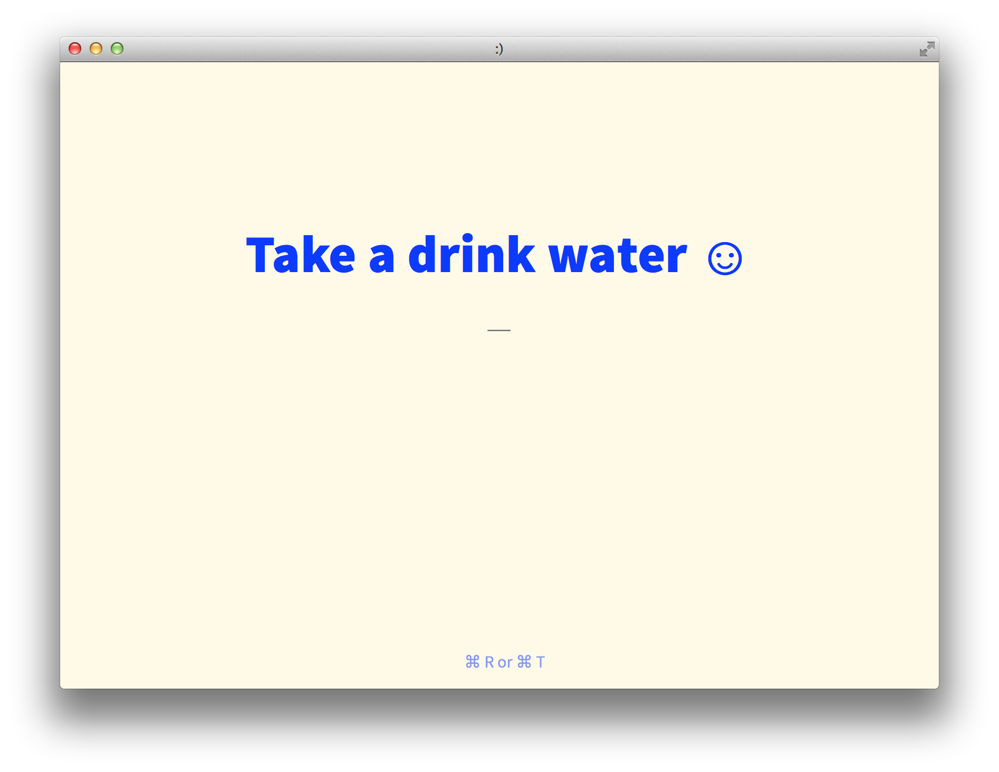

# WIP



### new-tab

A simple website that displays a random quote to be used as a new tab page in browsers.

**To use**

1. Clone this repo.
2. Set the location of the `index.html` as your browser's homepage.
 - `cd new-tab` and then `open index.html` and when it opens in your browser, that's the location.
3. Edit `quotes.js` with quotes, it should look like:

```javascript
var data =
[
  {
    "source": "Jessica Lord",
    "quote": "Today I made some lentil soup."
  },
  {
    "source": "Jessica Lord",
    "quote": "I went to Joaquin Miller park."
  },
  {
    "source": "Jessica Lord",
    "quote": "It is Saturday!"
  }
]
```

_Note about Chrome_
Chrome won't let you set a new tab page, so you have to use an extension to do so: [New Tab Redirect](https://chrome.google.com/webstore/detail/new-tab-redirect/icpgjfneehieebagbmdbhnlpiopdcmna/related).
